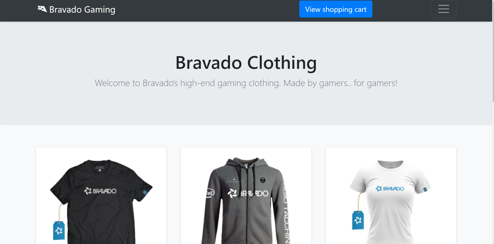
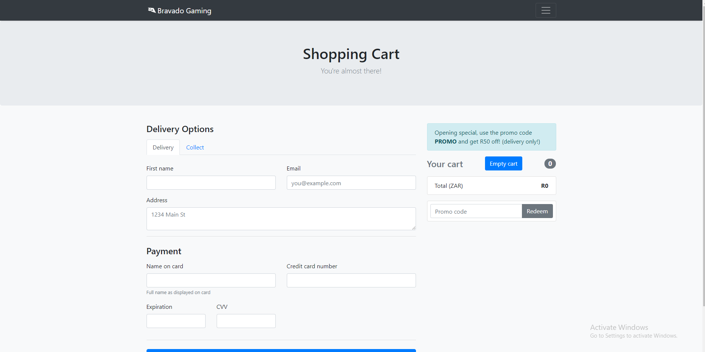

# Online Catalogue Page

In this project, I focused on JavaScript. I added functionality to my online store and created an 'add to cart page' page to make my webpage more interactive for the user. In my first catalogue page, I only used HTML and CSS. With the use of JavaScript, I was able to add alert messages and reactiveness to my page. 

## Table Of Content
1. Installation Guide
2. Usage Instructions
3. Credits

## Installation Guide
In the root of the repository, click on the green button clone/download.

## Usage Instructions
On the landing page, you can select a product that you'd like to purchase. Once you have filled up your cart you can select 'View Shopping Cart'. You have the option to use the promo code called 'PROMO' to save R50 off your order. If you select delivery you have the options to fill in your details so that the items can be delivered to you or you have the option to collect the items at the collection address.

## Credits

Authors for this task :
[Alton Cuff](https://github.com/AltonCuff)
